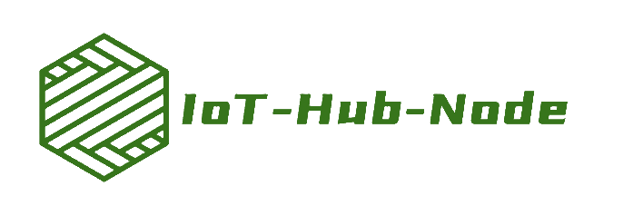

# IOT-Hub-Node是什么?

## 一、介绍

IoT-Hub-Node是一个基于 Node.js 的物联网设备接入管理平台，提供设备接入，设备管理，数据存储，指令下发，规则引擎等主流功能，旨在连接物联网设备和应用程序。它提供了一系列基于 HTTP 的REST API，用于实现设备接入、消息发送和接收，物模型管理和事件告警等。它还提供基于 MQTT，REST/HTTP，TCP/IP，websocket的通信接口，用于设备与物联网的连接(MQTT Broker使用开源版本的EMQX )。未来，我们还计划开发其他接口，例如基于CoAP的接口，以提供更多选择。

本项目使用Ts +Node.js 进行开发，支持云端或本地私有部署，并能在不同平台上运行。使用 MySQL 作为默认数据库，使用Redis做数据缓存，并采用 prisma 作为 ORM 框架，降低用户二次开发的门槛。采集的设备数据通过InfluxDB时序数据库存储，满足大量数据存储需求。此外，Node.js 本身的的异步非阻塞特性也使得其能够处理大量并发请求，具备高效处理能力。

项目主要分为三个部分，IoT-Hub-Node是物联网平台的后端部分，IoT-Hub-Node-Web是物联网平台的后台管理网站项目，
IOT-Hub-Embedded是一系列适配本平台的嵌入式项目集合。目前IoT-Hub-Node和IoT-Hub-Node-Web均以开源。

通过优化和不断改进，IoT-Hub-Node 可以支持各种物联网应用程序的开发，例如智能家居、智能工厂和智能农业等领域。它提供了强大的功能和灵活性，使得开发人员能够构建出高性能、可靠的物联网应用程序。

目前，IoT-Hub-Node还处于开发阶段，后续会逐步完善功能。

## 二、目的

本项目主要针对现有物联网平台在异构场景下设备接入困难、联动困难、缺乏统一管理、协议不统一、设备数据无法本地私有化等问题。提供一个基于 node.js 的物联网设备管理平台：实现设备接入、消息发送和接收，物模型管理和事件告警。为多场景、多设备互联、低成本上云、低成本数字化管理提供平台支撑。

也希望通过这个平台让没有物联网开发经验的开发者能够快速开发物联网应用程序，并让前端开发者更轻松地接触物联网领域。希望通过这个项目，让物联网开发者和嵌入式开发者能够更容易地接触物联网，体会 web 技术在嵌入式领域的使用。

## 三、功能架构

**IOT-Hub-Node**目前的架构目标是在实现设备接入和数据管理后尽可能多的开发用户侧功能。

